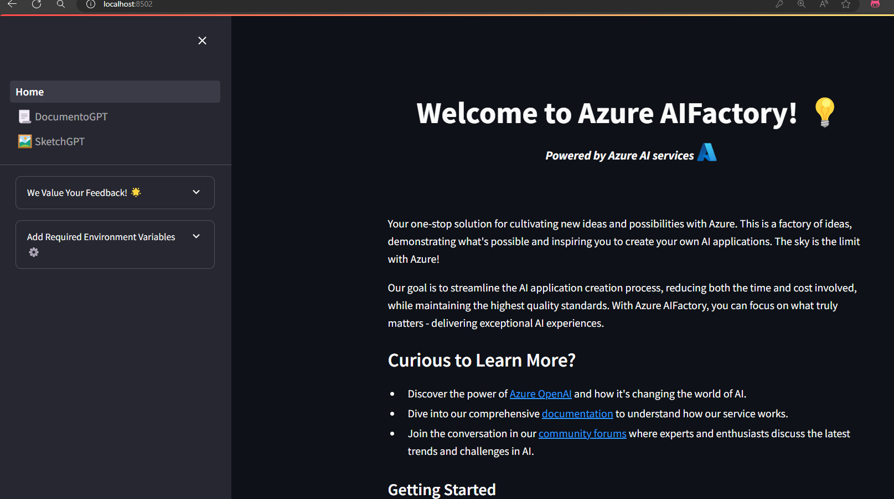

# AIFactory 

Welcome to the AIFactory project! This repository is designed to help you cultivate new ideas and possibilities with Azure AI, demonstrating what's possible and inspiring you to create your own AI applications.

The project provides an easy-to-use app built with Streamlit as the front-end framework. You are welcome to use the app as is, customize it to your needs, or utilize the backend code for your own applications.

<br>

<p align="center">
   
</p>

> 🚧 **Note: Work in Progress**  
> This project is actively evolving. Your contributions and feedback are invaluable to us. Please refer to the sections below for more information on how to get involved.

### DocumentoGPT

DocumentGPT utilizes Azure AI Document Intelligence and AOAI services, including GPT-4o and Whisper models, to automate document summarization, translation, and generation, aiming to improve efficiency in content management and accessibility.

What can you do with DocumentoGPT ?

- **Summarize Multimodal Content**: Easily upload documents, images, and audio files. Our tool provides concise summaries, making information consumption quicker and more efficient. Supported formats include .docx, .pdf, .pptx, images with text, and audio files.
- **Generate Documentation**: Transform complex topics or amalgamate multiple documents into a single, coherent, and user-friendly document. From executive memos to technical guides and presentations, we streamline documentation.
- **Break Language Barriers**: Translate documents and audio files across various formats, facilitating seamless communication in multiple languages.
- **Extract Key Insights**: Analyze documents to surface essential insights and specific details like names, dates, and places, simplifying information retrieval.
- **Interactive Document Engagement**: Navigate complex documents through a chat-like interface, asking questions and receiving answers based on the document's content.
- **Custom Document Creation**: Produce personalized documents from scratch or templates, catering to diverse needs such as reports, proposals, or research papers.

### SketchGPT

SketchGPT is a multi-agent system utilizing the Autogen framework on the backend. It employs DALL·E 3 as the artist agent for generating images and GPT-4o as the evaluator or critic agent. This collaboration automates the prompt generation process, leveraging user-provided evaluations to produce high-quality images.

What can you do with SketchGPT ?

- **Visualize Your Ideas**: Describe your vision, and Sketch GPT will bring it to life. From dreamy landscapes to detailed designs, your imagination sets the boundaries.

## 🛠️ How Can I Use the App? 

To deploy your Streamlit application locally, follow these steps:

1. **Create a Conda Environment**: First, you need to create a Conda environment using the `environment.yaml` file provided in the repository. Open your terminal and run:

   ```bash
   conda env create -f environment.yaml
   ```
To activate your Conda environment and run your Streamlit application, follow these steps:

2. **Activate Conda Environment**: After creating your environment, activate it using the command:
   ```bash
   conda activate <your_env_name>
   ```

3. **Launch the Application**: To start your Streamlit app, navigate to the `src/app` directory in your terminal and execute:

    ```bash
    streamlit run src/app/Home.py
    ```

## Project Evolution: AIFactory's Path Forward 🚀

**Embrace Continuous Innovation**

The AI Factory is on an exciting journey of growth, blending new ideas, tools, and methodologies to enhance your development journey. Our goal? To broaden your skills and spark innovation with the latest technology.

**Feedback & Issue Reporting: Your Insights Fuel Our Growth**

Encountered a bump or have ideas for enhancement? Let us know! Please [submit an issue](https://github.com/pablosalvador10/gbb-ai-factory/issues) on our GitHub repository. Your feedback is a cornerstone of our development process.

## 💼 Be Part of Our Journey

**Contribute: Make Your Mark**

Eager to contribute to the AI Factory? Dive into our [CONTRIBUTING guide](./CONTRIBUTING.md) and start making an impact.

**Stay Updated**

Follow our journey and stay updated with the latest changes by checking our [CHANGELOG.md](./CHANGELOG.md). Your involvement is vital for our collective success and continuous evolution.